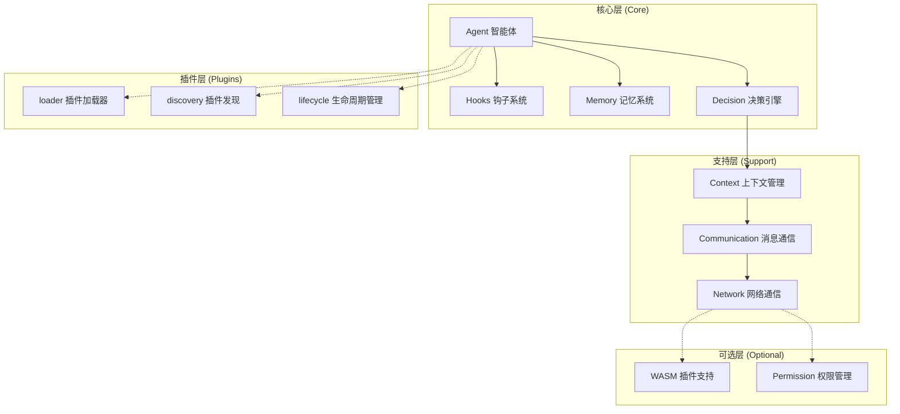
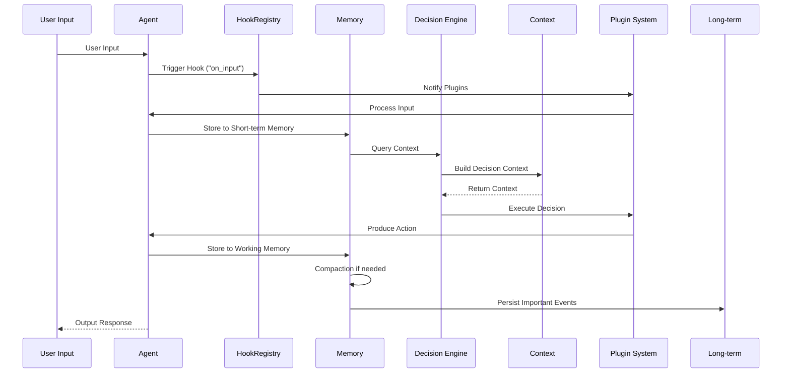
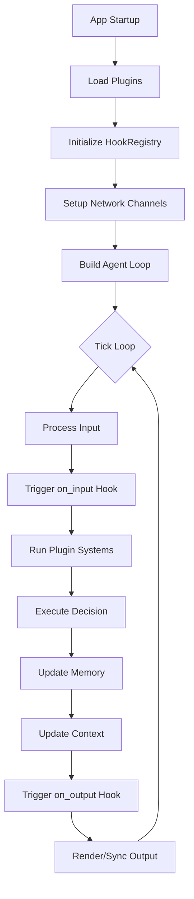

# agent-pet-rs

Rust framework for building intelligent virtual life forms with WASM plugins.

## Philosophy

The framework provides **infrastructure for creating customizable intelligent agents**. Domain logic (behaviors, interactions, etc.) lives entirely in user code via the plugin system.

| Layer | Location | What it contains |
|-------|----------|------------------|
| Framework | `src/` | HookRegistry, NetworkChannel, WASM bridge, Permission management |
| Plugin | `examples/` | Agent components, events, systems — built on framework API |

## Quick Start

```bash
# Run the agent demo (Bevy GUI)
cargo run --example basic_pet --features wasm-plugin

# Run the agent demo (CLI/TUI)
cargo run --example cli_pet

# Build the framework library only
cargo build

# Run tests
cargo test

# Check formatting + lint
cargo fmt --check
cargo clippy
```

**Controls (in demo):**

| Key | Action |
|-----|--------|
| F | Feed agent (costs 10 gold, +20 hunger) |
| H | Heal agent (+15 health) |
| G | Gain gold (+50) |
| 1 | Buy Basic Food (10g) |
| 2 | Buy Premium Food (25g) |
| 3 | Buy Elixir (50g) |
| R | Hot reload plugins |
| I | Show plugin info |
| P | Test permissions |

## Architecture

```
FrameworkSet::Input → Plugin systems (spawn, input)
FrameworkSet::Process → Plugin systems (simulation, economy)
FrameworkSet::Output → Plugin systems (UI, network sync)
```

Plugins extend the pipeline by inserting their own `SystemSet` between framework stages.

## 框架架构详解

### 整体架构图



### 模块详细说明

#### 1. Agent 模块 (智能体核心)

负责管理智能体的生命周期、状态和人格特征。

| 文件 | 功能描述 |
|------|----------|
| `core.rs` | Agent、AgentState、AgentConfig - 智能体核心定义 |
| `loop_impl.rs` | 智能体行为循环实现 |
| `personality.rs` | 人格特征系统 (Personality, PersonalityTrait) |
| `role.rs` | 角色系统 (Role, RoleTrait) |

#### 2. Hooks 模块 (钩子系统)

提供事件驱动的扩展机制，允许插件在特定时机插入自定义逻辑。

| 文件 | 功能描述 |
|------|----------|
| `registry.rs` | HookRegistry - 动态注册和管理钩子 |
| `runner.rs` | HookRunner - 钩子执行器 |
| `points.rs` | HookExecutionMode - 钩子执行模式 |
| `context.rs` | HookContext - 钩子执行上下文 |
| `hook_system.rs` | 完整的钩子系统实现 |

#### 3. Memory 模块 (记忆系统)

模拟智能体的记忆功能，分为短期、长期和工作记忆。

| 文件 | 功能描述 |
|------|----------|
| `short_term.rs` | ShortTermMemory - 短期记忆，存储当前会话信息 |
| `long_term.rs` | LongTermMemory - 长期记忆，持久化存储 |
| `working.rs` | WorkingMemory - 工作记忆，当前处理中的临时数据 |
| `compaction.rs` | MemoryCompactor - 记忆压缩策略 |
| `memory_impl.rs` | Memory、MemoryEntry - 记忆条目定义 |

#### 4. Decision 模块 (决策引擎)

为智能体提供决策能力，支持规则引擎和 LLM 引擎。

| 文件 | 功能描述 |
|------|----------|
| `engine.rs` | DecisionEngine、DecisionEngineTrait - 决策引擎接口 |
| `rule_based.rs` | RuleBasedEngine - 基于规则的决策引擎 |
| `llm_based.rs` | 基于 LLM 的决策引擎 |

#### 5. Context 模块 (上下文管理)

管理智能体的上下文信息，包括窗口和历史记录。

| 文件 | 功能描述 |
|------|----------|
| `builder.rs` | ContextBuilder - 上下文构建器 |
| `context_impl.rs` | Context、HistoryEntry - 上下文实现 |
| `window.rs` | ContextWindow - 上下文窗口管理 |

#### 6. Communication 模块 (消息通信)

处理智能体之间的消息传递和路由。

| 文件 | 功能描述 |
|------|----------|
| `channel.rs` | Channel、ChannelTrait、CLIChannel - 通道接口 |
| `message.rs` | Message、MessageType - 消息定义 |
| `router.rs` | MessageRouter、MessageHandler - 消息路由器 |

#### 7. Plugins 模块 (插件系统)

动态加载和管理插件的系统。

| 文件 | 功能描述 |
|------|----------|
| `loader.rs` | PluginLoader - 插件加载器 |
| `discovery.rs` | PluginDiscovery、DiscoveredPlugin - 插件发现 |
| `lifecycle.rs` | LifecycleHook、PluginLifecycleManager - 生命周期管理 |
| `capabilities.rs` | Capability、CapabilityRegistry - 能力注册 |
| `slots.rs` | Slot、SlotManager、SlotRegistration - 插槽管理 |
| `manifest.rs` | PluginManifestLoader - 插件清单加载器 |
| `validator.rs` | PluginValidator、ValidationResult - 插件验证 |

#### 8. Network 模块 (网络通信)

提供异步网络通信能力。

| 文件 | 功能描述 |
|------|----------|
| `mod.rs` | NetworkChannel、NetworkConfig - 网络通道定义 |

#### 9. 其他支持模块

| 模块 | 功能描述 |
|------|----------|
| `config.rs` | 配置管理 |
| `permission.rs` | 权限管理 |
| `dependency.rs` | 依赖解析 |
| `error.rs` | 错误处理 |

#### 10. WASM 插件支持 (可选)

当启用 `wasm-plugin` feature 时可用。

| 文件 | 功能描述 |
|------|----------|
| `plugin_trait.rs` | WasmPlugin trait - WASM 插件接口 |
| `wasmtime_loader.rs` | WASM 插件加载器 |
| `bridge.rs` | WasmPluginHost - WASM 插件主机 |
| `abi.rs` | WASM ABI 定义 |

### 数据流示意图



### 关键设计原则

1. **领域无关 (Domain-Agnostic)**: `src/` 框架层不包含任何领域特定逻辑（宠物、经济等）
2. **事件驱动 (Event-Driven)**: 通过 HookRegistry 实现事件挂钩机制
3. **插件化 (Plugin-Based)**: 所有领域逻辑通过插件系统实现
4. **泛型设计 (Generic)**: NetworkChannel\<T\>、HookRegistry 等使用泛型
5. **无全局状态 (No Global Mutability)**: 通过 Bevy Resources 管理状态

### 框架调用链



## Project Structure

```
agent-pet-rs/
├── src/                          # Framework core (generic, no domain knowledge)
│   ├── lib.rs                    # FrameworkPlugin, FrameworkSet
│   ├── prelude.rs                # Public API exports
│   ├── hooks/
│   │   └── hook_system.rs        # HookRegistry with Cow<str> keys
│   ├── network/
│   │   └── mod.rs                # NetworkChannel<T> generic channel
│   ├── config.rs                 # Plugin configuration
│   ├── dependency.rs             # Dependency resolution
│   ├── permission.rs             # Permission management
│   └── wasm/
│       ├── plugin_trait.rs       # WasmPlugin trait
│       ├── wasmtime_loader.rs    # WASM plugin loader
│       └── bridge.rs             # WasmPluginHost
├── examples/
│   ├── basic_pet.rs              # Bevy GUI demo
│   ├── cli_pet.rs                # CLI/TUI demo
│   ├── bevy_adapter.rs           # Bevy integration adapter
│   ├── wasm_hooks/               # Demo WASM plugin
│   ├── wasm_stats/               # Stats WASM plugin
│   ├── wasm_reader/              # Reader WASM plugin
│   ├── wasm_discount/            # Discount WASM plugin
│   └── config.json               # Plugin configuration
├── tests/
│   └── agent_tests.rs            # Framework unit tests
└── .github/workflows/ci.yml     # CI: fmt + check + test
```

## Core API

### HookRegistry

Dynamic, string-keyed event hooks with multiple subscribers:

```rust
use agent_pet_rs::prelude::*;

// Register
hooks.register_fn("my_hook", |ctx: &HookContext| {
    println!("triggered on {:?}", ctx.entity);
});

// Trigger
hooks.trigger("my_hook", &HookContext { entity });
```

### NetworkChannel\<T\>

Generic bidirectional channel for async networking:

```rust
let channel: NetworkChannel<MyDto> = NetworkChannel::default();

// Send outgoing
channel.send(dto)?;

// Receive incoming
let msgs = channel.drain_incoming();
```

### FrameworkSet

Ordered system sets for pipeline control:

```rust
app.configure_sets(Update, (
    FrameworkSet::Input,
    MyCustomSet,              // plugin inserts here
    FrameworkSet::Process,
    FrameworkSet::Output,
)).chain();
```

### WasmPlugin

Trait for WASM-based dynamic plugins (feature-gated):

```rust
// cargo build --features wasm-plugin
impl WasmPlugin for MyPlugin {
    fn name(&self) -> &str { "my_plugin" }
    fn on_tick(&self, entity_id: u64) { }
    fn on_event(&self, entity_id: u64, event: &str, data: &str) { }
}
```

## Building a Plugin

See `examples/basic_pet.rs` for a complete example. Minimal structure:

```rust
use bevy::prelude::*;
use agent_pet_rs::prelude::*;

struct MyPlugin;

impl Plugin for MyPlugin {
    fn build(&self, app: &mut App) {
        app.add_event::<MyEvent>()
            .add_systems(Update, my_system.in_set(FrameworkSet::Process));
    }
}

fn main() {
    configure_backend();
    App::new()
        .add_plugins(DefaultPlugins)
        .add_plugins(FrameworkPlugin)
        .add_plugins(MyPlugin)
        .run();
}
```

## CI

GitHub Actions runs on every push/PR to `master`:

- `cargo fmt --check`
- `cargo check --all-targets`
- `cargo test`

## License

TBD
